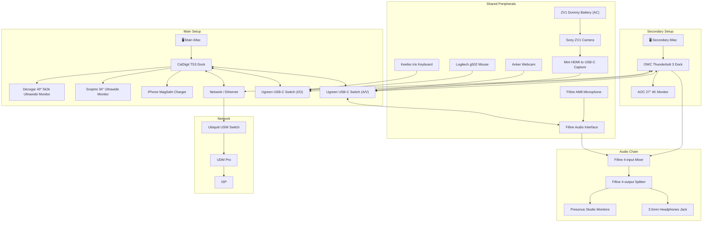

# Desk Setup

```mermaid
flowchart TB
    %% Main Setup
    subgraph main["Main Setup"]
        MainMac["🖥️ Main iMac"]
        CalDigit["CalDigit TS3 Dock"]
        Decogar["Decogar 40&quot; 5k2k Ultrawide Monitor"]
        Sceptre["Sceptre 34&quot; Ultrawide Monitor"]
        MagSafe["iPhone MagSafe Charger"]

        MainMac --> CalDigit
        CalDigit --> Decogar
        CalDigit --> Sceptre
        CalDigit <--> SwitchAV
        CalDigit <--> SwitchIO
        CalDigit <--> NetworkEth
        CalDigit --> MagSafe
    end

    %% Secondary Setup
    subgraph secondary["Secondary Setup"]
        SecondaryMac["🖥️ Secondary iMac"]
        OWC["OWC Thunderbolt 3 Dock"]
        AOC["AOC 27&quot; 4K Monitor"]

        SecondaryMac --> OWC
        OWC --> AOC
        OWC <--> SwitchAV
        OWC <--> SwitchIO
        OWC <--> NetworkEth
    end

    %% Shared Peripherals
    subgraph peripherals["Shared Peripherals"]
        SwitchAV["Ugreen USB-C Switch (A/V)"]
        SwitchIO["Ugreen USB-C Switch (I/O)"]
        FifineInterface["Fifine Audio Interface"]
        FifineMic["Fifine AM8 Microphone"]
        AnkerCam["Anker Webcam"]
        SonyZV1["Sony ZV1 Camera"]
        HDMICapture["Mini HDMI to USB-C Capture"]
        DummyBattery["ZV1 Dummy Battery (AC)"]
        Keyboard["Keebio Iris Keyboard"]
        Mouse["Logitech g502 Mouse"]

        SwitchAV <--> FifineInterface
        FifineMic --> FifineInterface
        AnkerCam --> SwitchAV
        DummyBattery --> SonyZV1
        SonyZV1 --> HDMICapture
        HDMICapture --> SwitchAV
        Keyboard --> SwitchIO
        Mouse --> SwitchIO
    end

    %% Audio Chain
    subgraph audio["Audio Chain"]
        FifineMixer["Fifine 4-input Mixer"]
        FifineSplitter["Fifine 4-output Splitter"]
        Monitors["Presonus Studio Monitors"]
        Headphones["3.5mm Headphones Jack"]

        FifineInterface --> FifineMixer
        OWC --> FifineMixer
        FifineMixer --> FifineSplitter
        FifineSplitter --> Monitors
        FifineSplitter --> Headphones
    end

    %% Network
    subgraph network["Network"]
        NetworkEth["Network / Ethernet"]
        UbiSwitch["Ubiquiti USW Switch"]
        UDM["UDM Pro"]
        ISP["ISP"]

        NetworkEth --> UbiSwitch
        UbiSwitch --> UDM
        UDM --> ISP
    end
```
